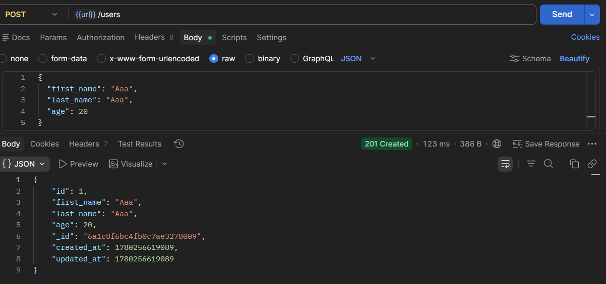
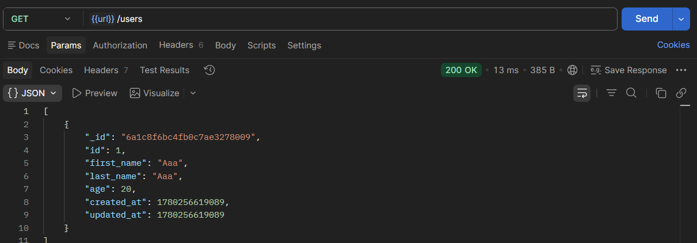
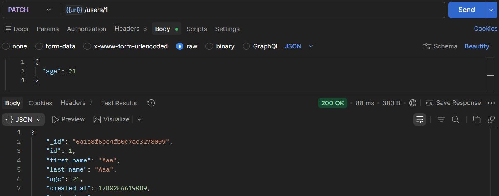

## 1. Создание пользователя

`POST http://localhost:3000/api/users`

```json
{
  "first_name": "Ааа",
  "last_name": "Ааа",
  "age": 20
}
```



## 2. Получение списка пользователей

`GET http://localhost:3000/api/users`



## 3. Получение пользователя по id

`GET http://localhost:3000/api/users/1`


## 4. Обновление пользователя

`PATCH http://localhost:3000/api/users/1`

```json
{
  "age": 21
}
```



## 5. Удаление пользователя

`DELETE http://localhost:3000/api/users/1`

