## 1. Регистрация пользователя

`POST http://localhost:3000/api/auth/register`

```json
{
  "email": "seller@example.com",
  "first_name": "Seller",
  "last_name": "User",
  "password": "1234",
  "role": "seller"
}
```

## 2. Вход пользователя

`POST http://localhost:3000/api/auth/login`

```json
{
  "email": "seller@example.com",
  "password": "1234"
}
```

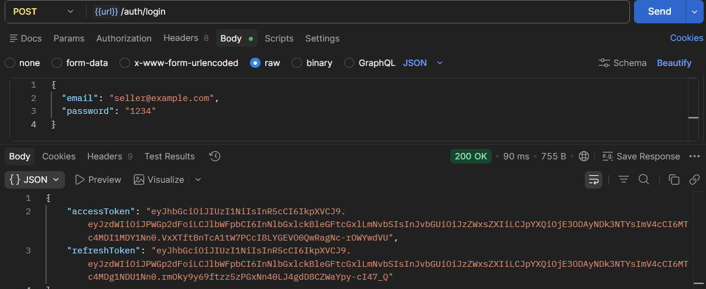

## 3. Получение текущего пользователя

`GET http://localhost:3000/api/auth/me`

```text
Authorization: Bearer <accessToken>
```

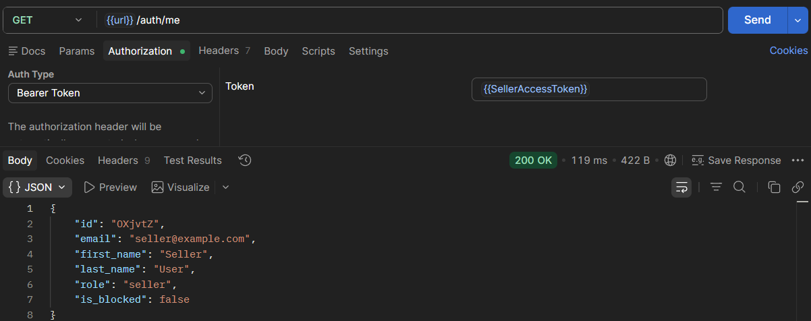

## 4. Регистрация администратора

`POST http://localhost:3000/api/auth/register`

```json
{
  "email": "admin2@example.com",
  "first_name": "Admin",
  "last_name": "Two",
  "password": "1234",
  "role": "admin"
}
```

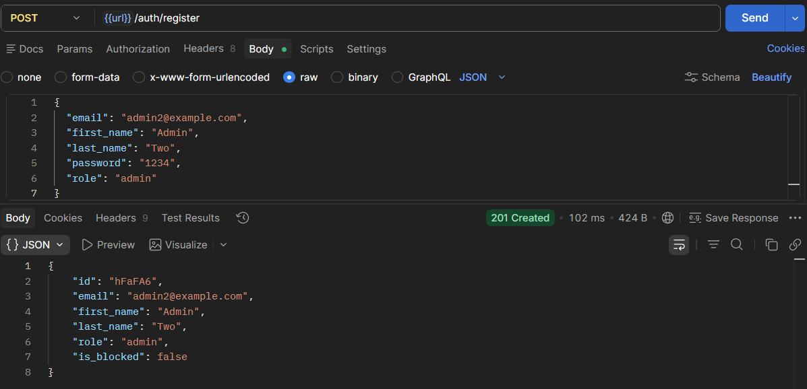

## 5. Вход администратора

`POST http://localhost:3000/api/auth/login`

```json
{
  "email": "admin2@example.com",
  "password": "1234"
}
```

## 6. Получение списка пользователей

`GET http://localhost:3000/api/users`

```text
Authorization: Bearer <adminAccessToken>
```

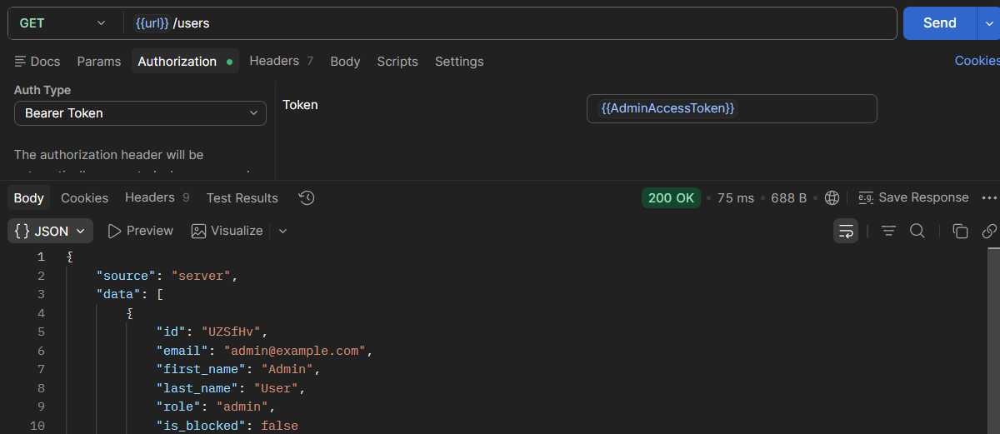

## 7. Повторное получение списка пользователей из Redis

`GET http://localhost:3000/api/users`

```text
Authorization: Bearer <adminAccessToken>
```

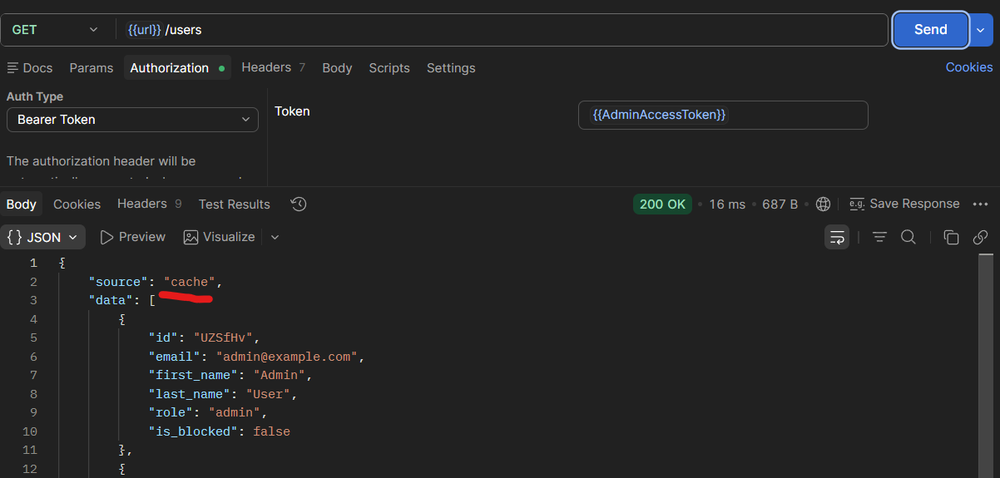

## 8. Получение пользователя по id

`GET http://localhost:3000/api/users/<userId>`

```text
Authorization: Bearer <adminAccessToken>
```

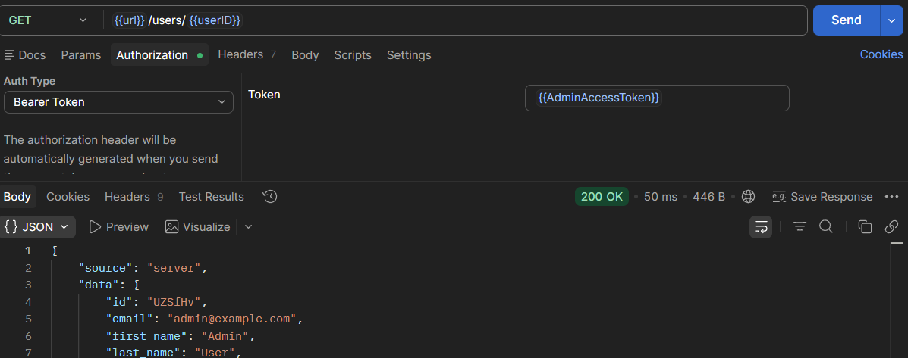

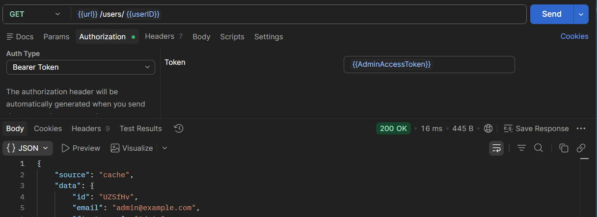


## 11. Получение списка товаров

`GET http://localhost:3000/api/products`

```text
Authorization: Bearer <sellerAccessToken>
```

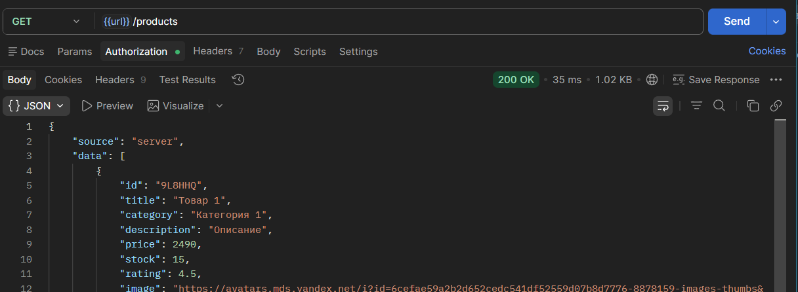


## 13. Получение товара по id

`GET http://localhost:3000/api/products/<productId>`

```text
Authorization: Bearer <sellerAccessToken>
```

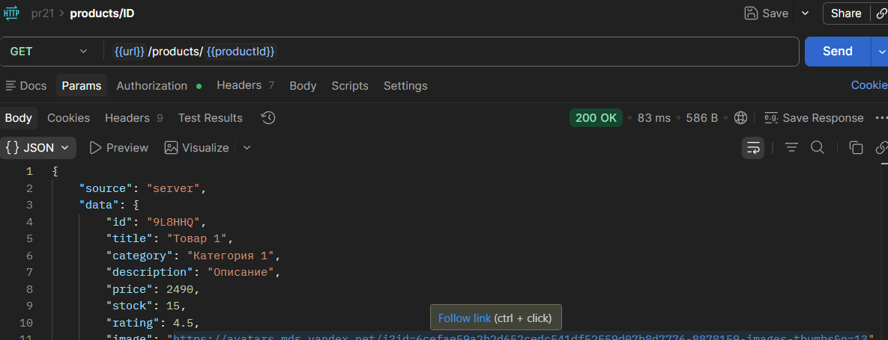

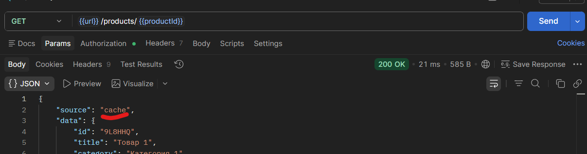

## 14. Обновление товара

`PUT http://localhost:3000/api/products/<productId>`

```text
Authorization: Bearer <sellerAccessToken>
```

```json
{
  "title": "Товар 4 обновленный",
  "category": "Категория 3",
  "description": "Новое описание",
  "price": 1290,
  "stock": 10,
  "rating": 4.5,
  "image": "https://example.com/new-image.jpg"
}
```

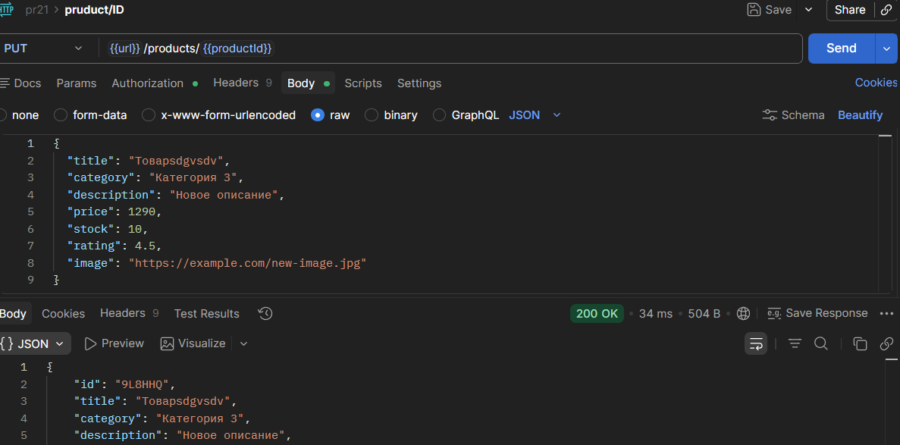

После этого

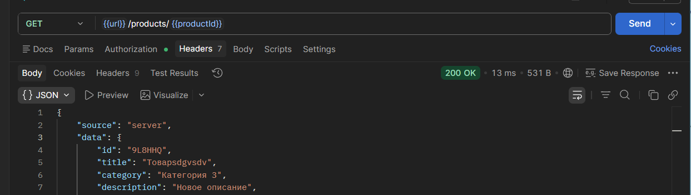