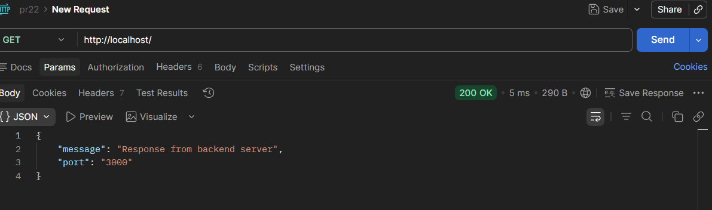
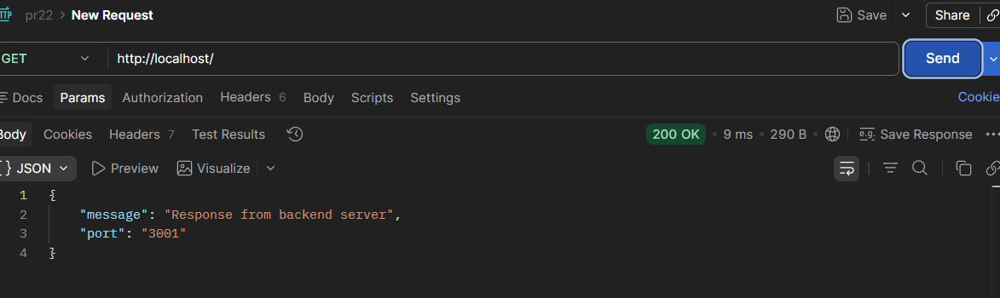
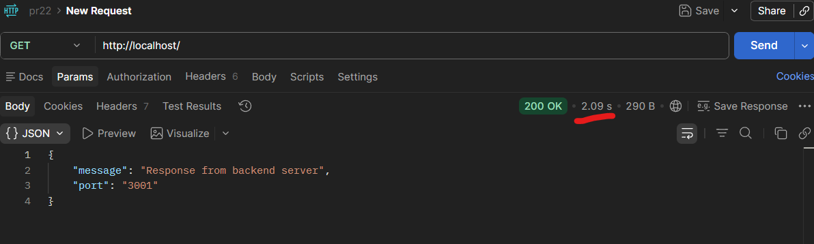
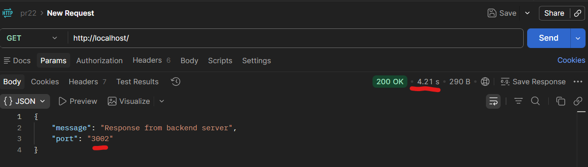

## Проверка Nginx

```powershell
C:\nginx\nginx.exe -c C:\Users\daria\WebstormProjects\uni-fab-4-kr4\22pr\nginx.conf -p C:\nginx\
```

`GET http://localhost/`






## Проверка отказоустойчивости 

Остановить один сервер и снова выполнить запросы




Остановить два

