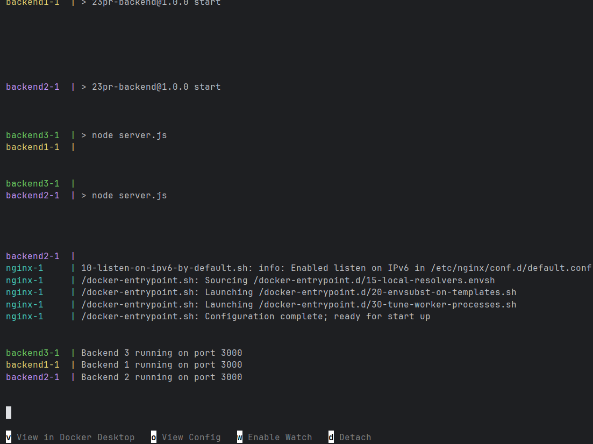
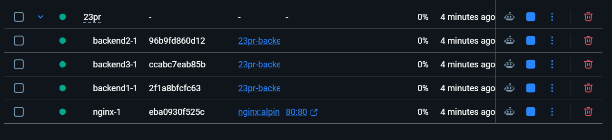
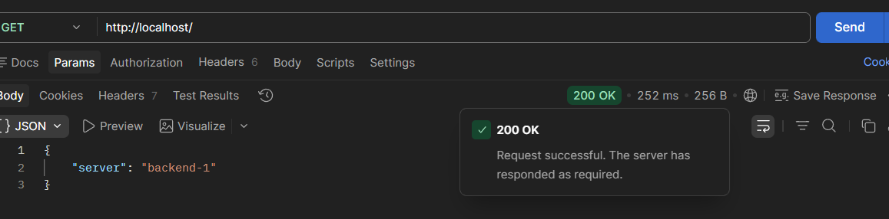
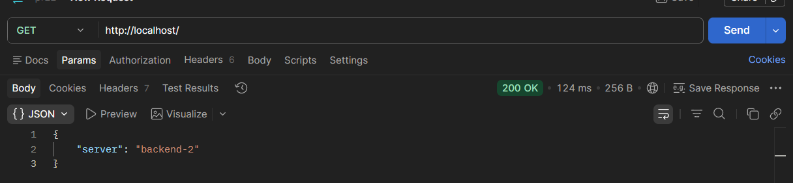
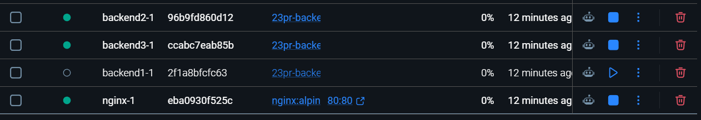
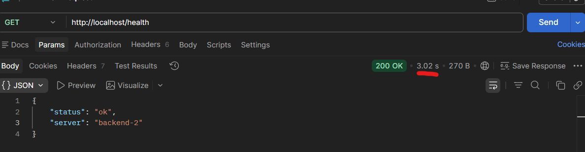

## Запуск Docker Compose

```bash
docker compose up --build
```






## Проверка балансировки через Nginx

`GET http://localhost/`








## Проверка отказоустойчивости после остановки backend1

```bash
docker compose stop backend1
```







## настройки max_fails и fail_timeout


